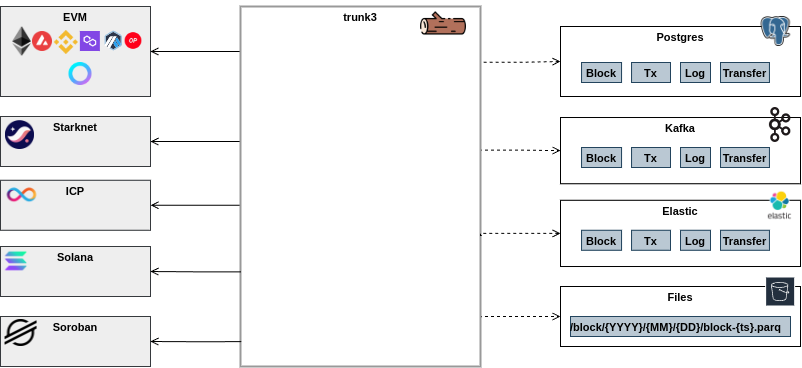

# trunk3

Streaming Web3 RPC ingestion engine

- Multichain (see Sources)
- `Latest` state support (file)
- Range stream (`start`:`end` blocks)
- Entities (`block`,`transaction`,`tx`(fat transaction),`log`)
- Lag support (to avoid re-orgs)
- Reorg support (to detect re-orgs)
- Different Sink destinations (kafka,files) and formats (json,parquet)
- File Sink timestamp partitions support





## Sources

| source | uri | description | comments |
|--------|-----|--------------|----------|   
| EVM    | http://geth:8545 | Standard EVM RPC             | 
| [Telos](#telos)  | https://telos | Telos EVM RPC             | (see receiptes request)
| [ethereumetl](https://github.com/syspulse/ethereum-etl)|     | From ethereumetl stream (kafka) |
| ICP | icp:// | Dfinity Rosetta/[Ledger](https://ledger-api.internetcomputer.org/swagger-ui/#/) RPC | 
| Starknet | stark:// | Starknet RPC (default is Lava) |
| Vechain | vechain:// | Vechain RPC (default is public RPC) | 
| Stellar | stellar:// | Stellar Horizon RPC | 
| Solana | sol://, sol:dev:// | Solana RPC (dev,test) | 
|  |  |

By default Source is `stdin`

## Entities

Entity is specified as `entity.blockchain` (e.g `block.icp` - ICP block)

| Entity |  Supported Blockchain| description |
|--------|-----|--------------|
| block       | .eth .icp .stark| Block       |
| transaction | .eth .icp .stark| Transaction (with status and block info)     |
| log         | .eth| Event Logs | 
| token       | .eth| Token Transfer |
| tx          | .eth .stark| Fat Transaction (with block, receupt and logs ) | 
|     |  |


If no blockchain suffix is specified, `eth` (`rpc`) is assumed
 
## Sinks

`trunk3` uses [skel-ingest](https://github.com/syspulse/skel/tree/main/skel-ingest) Pipeline engine and can stream into any supported sinks:

https://github.com/syspulse/skel/tree/main/skel-ingest#output-feeds


By default it streams into `stdout` without formatting


## Usage Examples


### via RPC

Blocks from latest:
```
./run-trunk.sh -e block -f http://geth:8545 --block=latest 
```

Blocks catch-up:
```
./run-trunk.sh -e block -f http://geth:8545 --throttle=30000
```

Blocks from specific block in batches:
```
./run-trunk.sh -e block -f http://geth:8545 --block=19999 --batch=10
```

Blocks Range:
```
./run-trunk.sh -e block -f http://geth:8545 --block=0 --block.end=100
```

Blocks Range with delay between batches:
```
./run-trunk.sh -e block -f http://geth:8545 --block=10000 --block.end=100000 --block.throttle=3000
```

Blocks Range with throttling between blocks:
```
./run-trunk.sh -e block -f http://geth:8545 --block=10000 --block.end=100000 --batch=1 --block.throttle=1000
```


Filter by specific transactions:

```
./run-trunk.sh -e tx -f http://geth:8545 --block=20254722 --block.end=20254722 \
   --filter=0x4248cbd371e0c876ebafd7e088aec9f790d32280129663c46c6050c8de2dfa23,0x375ad6cd6b2d79995d697b4c6708b3dc73bbc04bf9e874cb8c3d105ef63560ec
```

Filter by specific block and transactions:

Blocks and Transactions in list

```
./run-trunk.sh -e tx -f http://geth:8545 --block=list://BLOCK-filter.tx --filter=file://TX-filter.tx
```


Blocks from the state file (to continue stream with restarts) to Kafka topic `blocks`
```
./run-trunk.sh -e block -f http://geth:8545 -o kafka://broker-1:9092/blocks --block=file://BLOCKS 
```

Transactions + Receipts + Event Logs:

```
./run-trunk.sh -e tx -f http://geth:8545
```

Transactions + Receipts + Event Logs and proxy it to Websocket clients as JSON:

```
./run-trunk.sh -e tx -f http://geth:8545 -o server:ws://0.0.0.0:9300/ws --format=json
```

### Lag (to prevent reorg-ed data)

It will produce stream from lastest block at the past block depth of `lag` parameter. 
For example, lag=1 will stream block 99 when latest block is 100. Thus if 100 is reorged, it will not be streamed but replaced with a new 100.
NOTE: Ethereum PoS reorgs are usually 1 block deep.

```
./run-trunk.sh -e block.eth -f http://geth:8545 --delimiter= --block=latest --lag=2 
```

### Reorg Detection (Blockchain re-organizations)

`--reorg` option allows to monitor reorganizations (new block replaces  old ones).

`--reorg` specifies how deep the history for old blocks must be

__NOTES__: 
1. It is important to have `throttle` small enough to detect fast reorgs (more detection than etherscan)
2. `--lag` and `--reorg` options are not compatible and should not be used together

Example of a command to show re-orged blocks:

(Be careful using it agains public RPC since it asks the node about latest block every second)
```
./run-trunk.sh -e block -f http://geth:8545 --delimiter= --block=latest --logging=WARN --reorg=2 --throttle=1000
```

Reorg supports `block` and `transaction` entity

----

## ICP

From default Ledger API

```
./run-trunk.sh -f icp:// -e transaction.icp
```

----

## VeChain

From default VeChain RPC

```
./run-trunk.sh -f vechain:// -e transaction.vechain
```

----

## Starknet

### From Lava

You must use `--batch=1` since Lava does not support batch requests

```
./run-trunk.sh -f stark:// -e transaction.stark --batch=1
```

### From Infura

From Infura Starknet RPC

Export Infura API key:

```
export INFURA_KEY=1234
```

```
./run-trunk.sh -f stark://infura:// -e transaction.stark --api.token=$INFURA_KEY
```

## Telos

Telos requires `---receipt.request=batch` 

```
./run-trunk.sh -f https://mainnet-eu.telos.net/evm -e transaction --receipt.request=batch
```


----

## Interceptor

Interceptor allows to test Transaction parsing logic in `javascript` and propagate results as Events to another sink destination.

Input data is stored in `inputs` variable. Since variable is Scala case class, access is via function call
For example, `hash` attribute of the tranaction or block can be accessed:
```
var hash = inputs.hash();
```

Use `-o null://` to suppress Transactions output

Use `-a` option to pipe Interceptions as Extractor Events objects. The same destination sinks as in `-o` supported. For example, piping Interceptions as HTTP webhook (use `--format=json` to pass as JSON payload)

```
./run-trunk.sh -e tx.icp -f icp:// -o null:// --script=file://scripts/script-icp-amount.js -a http://POST@localhost:8300/webhook --format=json
```

### Interceptor Examples

#### Extract ETH transfers from transactions:

[trunk-ingest/scripts/script-eth-tx.js](trunk-ingest/scripts/script-eth-tx.js)
```
var hash = inputs.hash();
var from = inputs.from();
var to = inputs.to().isDefined() ? inputs.to().get() : "";
var value = inputs.v();
var status = inputs.st().isDefined() ? inputs.st().get() : 1;
var output = hash + ": "+ status +": ("+ from + " -> " + to + " ("+value+"))";
var res = {tx_hash: hash, output: output};
Java.asJSONCompatible(res);
```

Run Ethereum ingest with interception script:
```
./run-trunk.sh -e tx -f http://geth:8545 -o null:// --script=file://scripts/script-eth-tx.js
```

#### Extractr ERC20 transfers from fat transactions (Extractor Tx):

[trunk-ingest/scripts/script-eth-ERC20.js](trunk-ingest/scripts/script-eth-ERC20.js)

```
./run-trunk.sh -e tx.extractor -f http://geth:8545 -o null:// --script=file://scripts/script-eth-ERC20.js
```


## Mempool

### Run from Websocket

```
./run-trunk.sh -e mempool.ws -f ws://geth:8546 --rpc.url=http://geth:8545 --throttle=1
```

### Run with Polling

Polling uses diff calculation to check only new Mempool transactions

```
./run-trunk.sh -e trace -f http://geth:8545 --rpc.url=http://geth:8545
```

## Replay

### Replaying previous transactions

To replay transactions `trunk` needs to know blocks of these transactions, thus it requires two parameter: 

- `--block=list://${BLOCKS}` - file with block number (file:// is already reserved for block numbers)
- `--filter=file://${TRANSACTIONS}` - file with a list of transactions (hashes)
- `--batch=1` - Override default batching

Example:

```
./run-trunk.sh -e tx.extractor --block=list://${BLOCK_FILE} --filter=file://${TX_FILE} --batch=1 --block.throttle=5000
```
